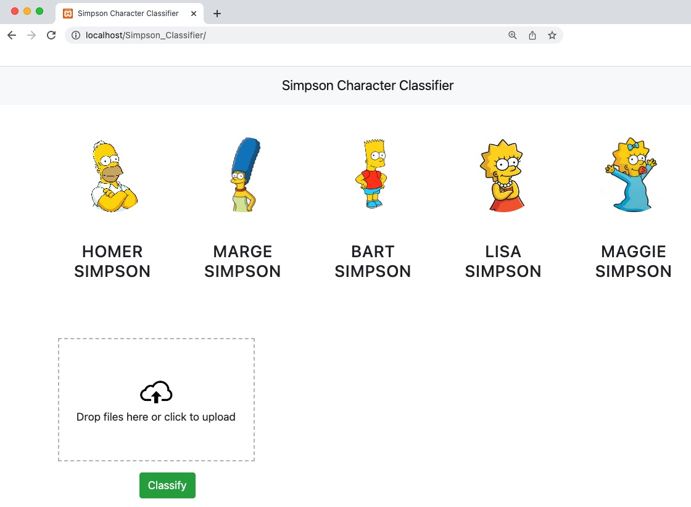

Author: Lynn Menchaca

Start Date: 28Nov2022

# Simpson Character Classifier
The purpose of this project is to identify which Simpson characters is in an image.

#### -- Project Status: Active

## Project Overview
### Resources
Hutson-Hacks -> Automating Google Chrome to Scrape Images with Selenium and Python
    https://www.youtube.com/watch?v=7KhuEsq-I8o

Youtube channel: Learn Code By Gaming -> Training a Cascade classifier - OpenCV Object Detection in Games #8
        https://www.youtube.com/watch?v=XrCAvs9AePM
        
Youtube channel: codebasics -> Data Science Project|Machine Learning Project|Sports Celebrity Image Classification
        https://www.youtube.com/playlist?list=PLeo1K3hjS3uvaRHZLl-jLovIjBP14QTXc

OpenCV - Open Source Computer Vision
        https://docs.opencv.org/3.4/dc/d88/tutorial_traincascade.html
        
OpenCV-Python Tutorials -> Face Detection using Haar Cascades 
        https://opencv24-python-tutorials.readthedocs.io/en/latest/py_tutorials/py_objdetect/py_face_detection/py_face_detection.html

### IDEs/Language/
* Jupyter
* Spyder
* Python
* Pandas
* HTML
* Json

### Machine Learning Models
* Logistic Regression
* Random Forest
* Support Vector Machine (SVM)
* GridSearchCV - Hypertuning

### Project Outline
1)	Web scrape Simpson character images
2)	Manually Identify the faces of each character
3)	Train OpenCV cascade file
4)	Train ML model
5)	Design webpage and deploy model

## Project Description

This project takes an image of a Simpson character and returns the name of the character identified. Five different Simpson characters were used for this project: Homer Simpson, Marge Simpson, Bart Simpson, Lisa Simpson and Maggie Simpson. If two characters are in the same photo this project can only identify one character in the photo.

### Web scraping the Simpson Images
Scrape_Google_Images.py

The web scrapper was programed in python and used selenium with chrome driver. All images were scrapped from Google images. Two sets of images were pulled positive and negative. The positive images are images with at least one of the five Simpson characters in it. For each Simpson character 150 images were saved. The negative images have no Simpson characters at all. For these I used images of inside and outside the house along with different animals in the TV show (example Itchy, Scratchy, Santa’s Little Helper, etc.). The positive images are used to train the machine learning model used to classify which Simpson character is in the image. The positive and negative images are used to train the OpenCV cascade xml file. The cascade file is used to detect and draw a rectangular box around the face in the image. 

This was performed multiple times to generate different positive and negative images that would improve the ML model and cascade (face detector).

### Detect Simpson Faces
Opencv_annotation.exe
Opencv_createsample.exe

The Opencv_annotation executable is used the manually identify the face in each positive image. For this process 6 folders were created, a folder for each individual character and their positive image and a folder with all the positive images in it. When I ran the executable on each individual character’s folder I only marked one face for that character in the image. After repeating this process for each image the executable outputs a text file with the path to the image and the coordinates of the face. This process was performed for each Simpson character and the text files created are later used to train the machine learning models. 

I also ran the Opencv_annotation executable on the folder with all the Simpson image. With this run I identified every person in the image. Use the positive text file created along with the dimensions of a rectangle on the Opencv_createsample executable, the output will create a vector file. The vector file is used for cascade training to create the positive samples of different images.

### Train OpenCV Cascade File
Opencv_traincascade.exe 
Simpson_cascade_xml_tester.ipynb

The Opencv_traincascade executable is used to generate an xml file that will detect the Simpson face in an image. The executable is run with the positive vector file along with a negative text file (path to each negative image). The settings I used with this executable were, number of stages, number of positive and negative images and sample dimensions for the negative images (same as used for the positive vector file). To train the cascade an image is shown. The program determines if it is one of the positive or negative images. The program adjusts depending on the answer. Depending on the what stage the cascade is training is how detailed the images is reviewed, the higher the stage the more detailed the image.

I used the Simpson_cascade_xml_tester.ipynb to test the cascade xml file on a set of test images.

This process was performed multiple time playing with the number of stages and negative images used. 

### Train ML Model
Simpson_classifier_model.ipynb

### Design Webpage and Deploy Model
Server/server.py
Server/util.py

UI/app.css
UI/app.html
UI/app.js

Server used is xampp.

### Results

### Project Improvement
Given more time I would finish deploying the webpage. 

